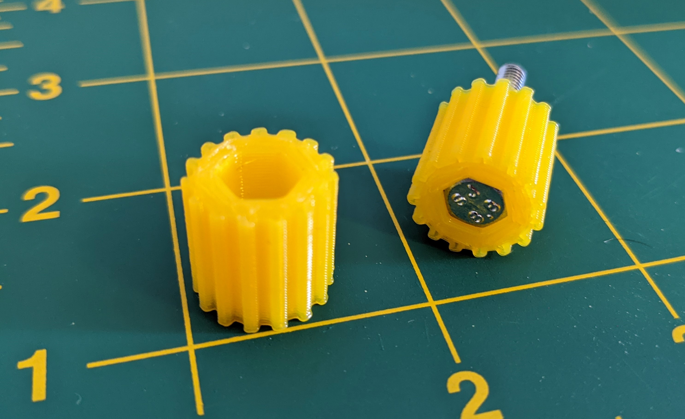
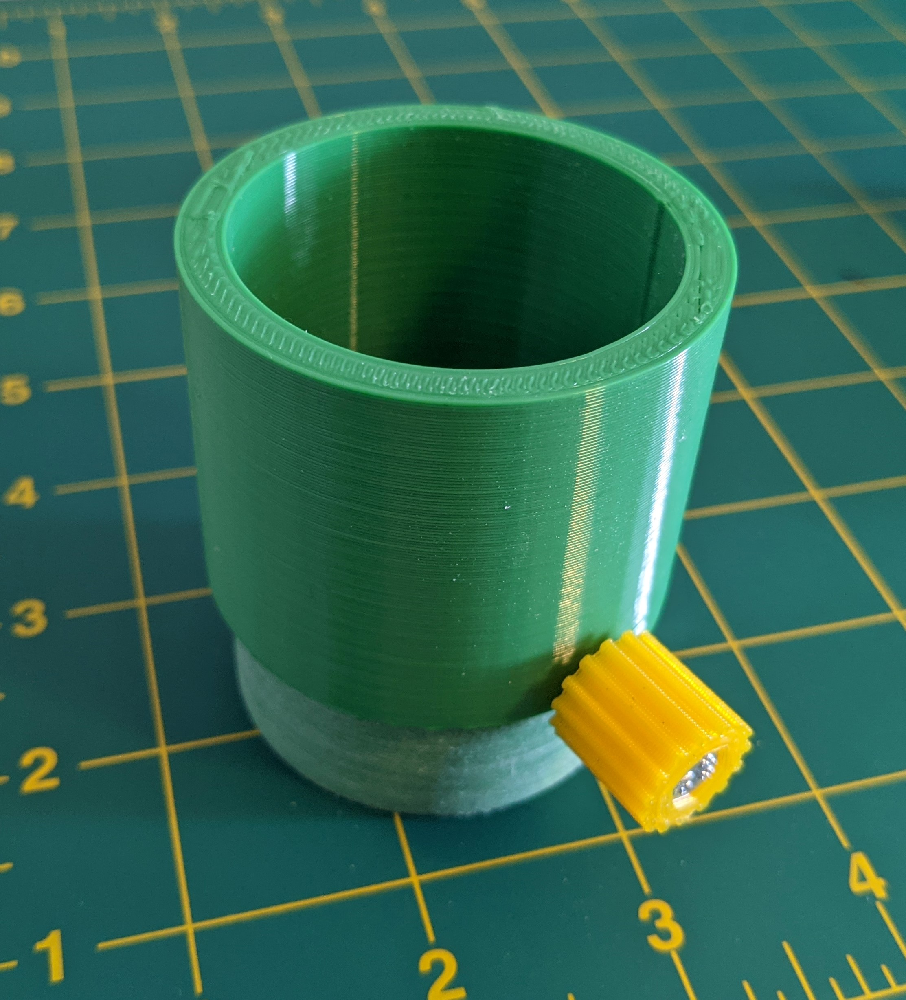
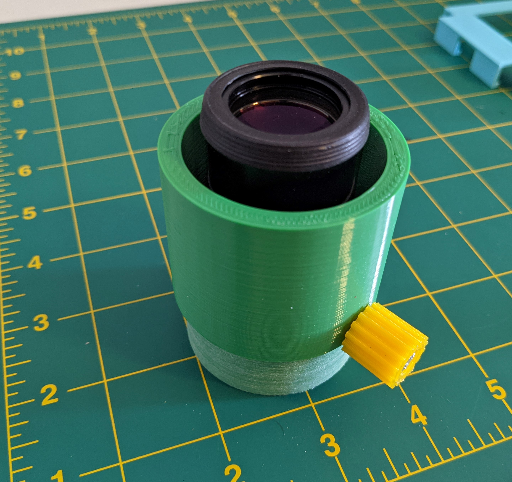
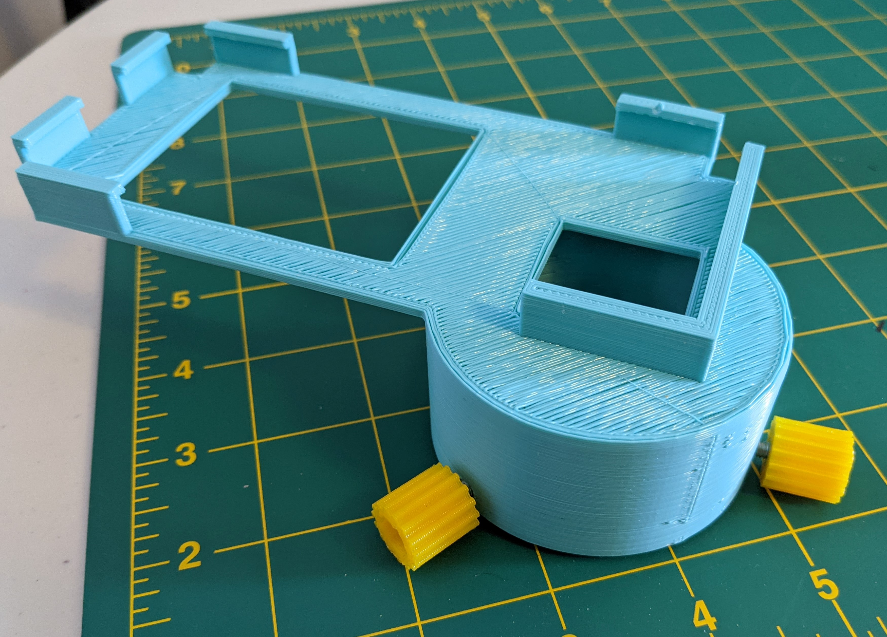
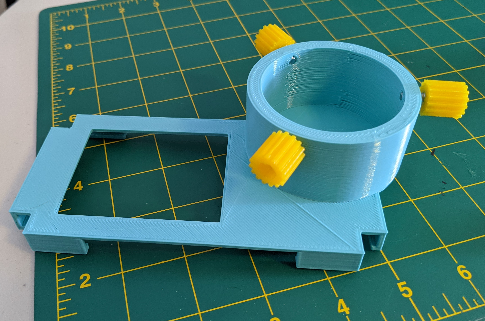
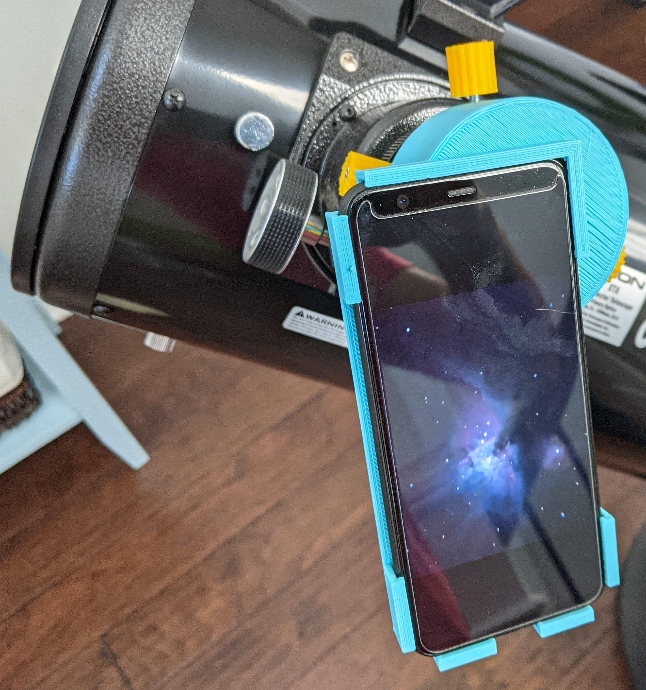
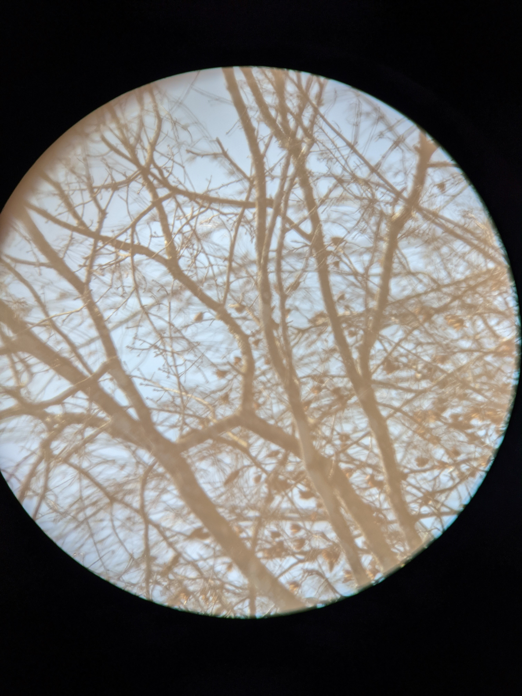

This is a set of models to take pictures using a Pixel 4 phone when using an eyepiece adapter.  For example, I use a 2" to 1.25" adapter to fit 1.25" eyepieces to my 8" Dobsonian (Orion SkyQuest XT8).  This project replaces the 2" to 1.25" adapter with a tube that a custom Pixel 4 case can attach onto.

You will need:
- access to a 3D printer
- enough plastics to print with
- 3x hex bolts of short length
- 1x hex bolt of longer length

All OpenSCAD input parameters are prefixed with `input_` and have initial values of what I used for my first full print.  For that I selected:
- short hex bolts: M4-0.7 x 10mm
- long hex bolt: M4-0.7 x 25mm
- eyepiece adapter height: 35mm
- eyepiece outer diameter: 56mm
- case adapter height: 35mm
- case inner diameter: 57mm

# The Parts

## Knurled Bolts

The bolts I got are not easily turned by hand so I printed knurled caps:
- eyepiece adapter: [scad](src/knurled-hex-cap.scad), [stl](stl/m4-knurled-cap-shallow.stl), [thingieverse]()
- case adapter: [scad](src/knurled-hex-cap.scad), [stl](stl/m4-knurled-cap.stl), [thingieverse](https://www.thingiverse.com/thing:4716337)

I did these in a bright color I could easily see on a dark night.  If I get some glow in the dark filiment again maybe that would be better...

No support required.

A center hole punch and a hole drilled in a bit of wood were used to gently drive the bolt into the cap.

## Eyepiece Adapter

A simple print that does require support.  Recommend printing in the orientation given.  You want to surface the 1.25" eyepiece rests on (inside the tube) to be smooth.  You also want the print to be tight.  You can sand it down.  This ensures you have a solid basis for the whole system.  Note there isn't anything specific to the Pixel 4 in this print!  If you have a different phone you could spend the time to create a case for it and use this adapter.

Print with supports.  Select a pretty good in-fill.  I did 50% and it's solid.

After printing use your long knurled bolt to "cut" threads in the hole.

[scad](src/telescope-eyepiece-adapter-with-extension.scad) [stl](stl/eyepiece-adapter-35mm.stl) [thingieverse]()

This will be used to hold your 1.25" eyepiece in the adapter.

## Pixel 4 Adapter

The phone adapter is printed attached to a phone case.  It attaches to the eyepiece adapter by screwing down 3 short bolts you created earlier.  This allows some small adjustments in where the camera.  Early prototypes tried to rely on friction of pieces only but there were two key problems.  First I found it hard to nail down the tolerances, so prints were never quite the right diameters.  Second when I did get it right the weight of the phone on the case could cause things to misalign.

Print with supports.  Select a pretty good in-fill.  I did 50% and it's solid. (Yes, this is the same as the eyepiece adapter.)

After printing use the short knurled bolst to "cut" threads in each of the 3 holes.

[scad](src/pixel4-eyepiece-adapter.scad) [stl](stl/pixel4-eyepiece-adapter-35mm.stl) [thingieverse]()

# Final Results

It is really great!  After days of fiddling, test prints, and learning (aka failure) this model is rock solid.

## Install Eyepiece

The 1.25" eyepiece is placed into the eyepiece adapter.  Gently tighten the thumb screw like you'd do on a "normal" adapter.

## Put on Telescope

Install the eyepiece adapter on your scope's focuser.  You can focus now assuming you can get your eye in a good place relative to the eyepiece.

![Eyepiece on Telescope][images/eyepiece-adapter-on-telescope.jpg]

## Install Camera

Add the camera in the case and gently tighten screws.  Turn on the camera and focus if you couldn't before or you bumped something.

## Take Pictures!

And since it's not night yet when I wrote this, here's a shot of some random trees down the road from my house.  Using a 25mm eyepiece with the XT8 (1200mm focal length) means 48x magnification.

